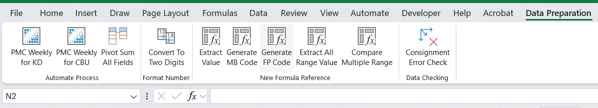

# VBA Microsoft Excel AddIns Installation for Automation Task


---
Creating Add-Ins in Microsoft Excel through VBA code greatly simplifies the automation process. Its main advantage is saving memory and eliminating the need to open multiple worksheets (.xlsb) to run macros. If you’re new to VBA and Excel macros, you’ll want to read my notes on [Getting Started](#how-to-get-started). For further assistance and detailed requests, please feel free to contact me through the profile information -->  kindly warm request to **(WA) +62 87738014079**.


# Table of Contents
* [*How to Get Started*](#how-to-get-started)
* [Automation prepare data](#Automation-prepare-data)
* [Create your own formula](#Create-your-own-formula)
* [Auto SumAllFields in PivotTable](#Auto-SumAllFields-in-PivotTable)
* [Automation IF formula with VBA](#Automation-IF-formula-with-VBA)
* [Advance Multiple Compare Data](#Advance-Multiple-Compare-Data)
* [Checking Data Anomalies](#Checking-Data-Anomalies)
* [Notes & Best Practices for Macros](#Notes-&-Best-Practices-for-Macros)


## Automation prepare data
This is the common use of macros: performing data filtering from raw to clean often takes a lot of time, especially when the task is repetitive. Moreover, if the dataset is large, it can cause lagging during the process. By using custom macros, all of this can be avoided.

```bas
Sub Automate_PMC_Weekly()
'
' Automate_PMC_Weekly_Check Macro
'

'

    ActiveCell.Offset(3, 11).Range("A1").Select
    ActiveSheet.Range("$A$4:$CJ$5395").AutoFilter Field:=12, Criteria1:=Array( _
        "3", "5", "6", "9", "="), Operator:=xlFilterValues
    ActiveCell.Offset(0, 1).Range("A1").Select
    ActiveSheet.Range("$A$4:$CJ$5395").AutoFilter Field:=13, Criteria1:="="
    ActiveCell.Offset(1, -12).Range("A1").Select
    Range(Selection, Selection.End(xlDown)).Select
    Range(Selection, Selection.End(xlDown)).Select
    Range(Selection, Selection.End(xlToRight)).Select
    Range(Selection, Selection.End(xlToRight)).Select
    Selection.Delete Shift:=xlUp
    On Error Resume Next
    ActiveSheet.ShowAllData
    On Error GoTo 0
    ActiveCell.Offset(-1, 9).Range("A1").Select
    ActiveSheet.Range("$A$4:$CJ$2199").AutoFilter Field:=10, Criteria1:="C"
    ActiveCell.Offset(407, -9).Range("A1").Select
    Range(Selection, Selection.End(xlToRight)).Select
    Range(Selection, Selection.End(xlToRight)).Select
    Range(Selection, Selection.End(xlDown)).Select
    Range(Selection, Selection.End(xlDown)).Select
    Range(Selection, Selection.End(xlToRight)).Select
    Range(Selection, Selection.End(xlToRight)).Select
    Selection.Delete Shift:=xlUp
    On Error Resume Next
    ActiveSheet.ShowAllData
    On Error GoTo 0
    Dim lastRows As Long
    Dim j As Long

    ' Find the last row in column A
    lastRows = ActiveSheet.Cells(Rows.Count, "A").End(xlUp).Row

    ' Loop through the rows from the bottom to the top
    For j = lastRows To 1 Step -1
        ' Check if the cell in column A contains "M69"
        If InStr(1, ActiveSheet.Cells(j, "A").Value, "M69", vbTextCompare) > 0 Then
            ' If "M69" is found, delete the entire row
            ActiveSheet.Rows(j).Delete
        End If
    Next j
....
....
....
```

[➥full code](/Module4.bas)
    
## Create your own formula
If cell A1 contains the value: `A`,
and cell A2 contains the value: `null`,
and cell A3 contains the value: `null`,

I want to extract the data from `A1:A3` and get only the unique value. **Excel does not provide such a formula by default**, but we can create it using VBA code.

By running a custom formula that we build ourselves, for example `=FILLEDVALUE(A1:A3)`, the data can be extracted instantly. the output will be `A` and ignore `null` value. This is just an example—identify the challenges in your work, and new formulas can be created easily to solve them.
```bas
Function FILLEDVALUE(rng As Range) As Variant
    Dim cell As Range
    Dim hasil As String
    hasil = ""
    
    For Each cell In rng.Cells
        If cell.Value <> "" Then
            hasil = cell.Value
....
....
....
```

[➥full code](/Module2.bas)

## Auto SumAllFields in PivotTable
The most exhausting part of working with PivotTables is that the column data must be set to `SUM` But when you’re dealing with more than 20 columns, isn’t that tired? With this function, everything can be changed with just a single click on your tab. you can change calculate function into COUNT or whatever, depend on your needs.

```bas
Sub SumAllValueFields()
  Dim pt As PivotTable
  Dim pf As PivotField
  Dim ws As Worksheet

  Set ws = ActiveSheet
  Set pt = ws.PivotTables(1)
  Application.ScreenUpdating = False

    pt.ManualUpdate = True
    For Each pf In pt.DataFields
....
....
....
```
[➥full code](/Excel-VBA-Automation-Process/Module1.bas)

## Automation IF formula with VBA
If you often use the `IF` formula, it can indeed be very useful, right? However, when it’s used repeatedly on the same type of data with different conditions, it becomes quite exhausting—and I strongly do not recommend doing so. Why not make it automatic instead? Extract the data and generate the output exactly as we want. You can create new formula like this `=MBGENERATE(A1)` and output decide on your choice like `=IF()` formula. but more expert and efficient.

```bas
Function MBGENERATE(cell As Range) As Variant
    Dim cellValue As String
    cellValue = UCase(Trim(cell.Value))
    
    If cellValue = "Green" Or cellValue = "Red" Or cellValue = "Brown" Or cellValue = "example1" Or cellValue = "example2" Or cellValue = "example3" Then
        MBGENERATE = 1
    ElseIf cellValue = "example3" Or cellValue = "example4" Or cellValue = "example5" Or cellValue = "example6" Or cellValue = "example7" Or cellValue = "example8" Or cellValue = "example9" Or cellValue = "example10" Or cellValue = "example11" Or cellValue = "example12" Or cellValue = "example13" Or cellValue = "example14" Or cellValue = "example15" Or cellValue = "example16" Or cellValue = "example17" Or cellValue = "example18" Or cellValue = "example19" Then
        MBGENERATE = 5
    ElseIf cellValue = "example20" Or cellValue = "example21" Or cellValue = "example22" Or cellValue = "example23" Then
        MBGENERATE = 6
....
....
....
```
[➥full code](/Module7.bas)

## Advance Multiple Compare Data
Don’t be the guy staring at the screen, checking every single cell for errors. The formula `=A1=A2` only works for comparing two cells. But what if you need to compare more than 2 cells—3 cells, 4 cells, and so on? **Excel doesn’t provide such a formula**. That’s why we can create our own, for example: `=RANGECOMPARE(A1:A2,B1:B2)` and output will be same as `=A1=A2`, `TRUE` or `FALSE`.

```bas
Function RANGECOMPARE(ParamArray ranges() As Variant) As Boolean
    Dim i As Long, j As Long
    Dim baseRange As Range
    Dim cell1 As Range
    Dim isEqual As Boolean
    
    ' Ensure there is at least two ranges to compare
    If UBound(ranges) < 1 Then
        MsgBox "Harus ada minimal dua rentang untuk dibandingkan.", vbExclamation
        RANGECOMPARE = False
        Exit Function
    End If
    
    ' Ensure all ranges have the same number of cells
    Set baseRange = ranges(0)
    For i = 1 To UBound(ranges)
        If baseRange.Count <> ranges(i).Count Then
            MsgBox "Jumlah rentang sel yang dibandingkan harus sama.", vbExclamation
            RANGECOMPARE = False
            Exit Function
        End If
    Next i
....
....
....
```
[➥full code](/Module9.bas)

## Checking Data Anomalies
I have a rule that all leveling data must follow a strict sequence, and certain columns are not allowed to contain duplicate values. If there is any deviation from this sequence, it is classified as an error. Checking this manually is relatively simple in theory, but with over 7,000 rows of data, the process becomes time-consuming and highly impractical.

By clearly defining the anomaly rules, we can leverage automation to improve efficiency. With the help of a macro, the system can instantly scan the dataset, identify any irregularities, and highlight the specific rows that contain errors—all with a single click. This not only eliminates the need for manual inspection but also ensures consistency, accuracy, and significant time savings in large-scale data validation processes.

```bas
Sub Check_Error_Level()
    Dim ws As Worksheet
    Dim lastRow As Long
    Dim i As Long
    Dim LV1 As Variant, LV2 As Variant
    Dim J1 As String, J2 As String
    Dim FP1 As String, FP2 As String
    Dim P1 As String, P2 As String
    Dim answer As VbMsgBoxResult
    Dim found As Boolean
    
    Set ws = ActiveSheet
    lastRow = ws.Cells(ws.Rows.Count, "D").End(xlUp).Row
    found = False
    
    For i = 2 To lastRow - 1
        LV1 = ws.Cells(i, "D").Value
        LV2 = ws.Cells(i + 1, "D").Value
        J1 = Trim(CStr(ws.Cells(i, "J").Value))
        J2 = Trim(CStr(ws.Cells(i + 1, "J").Value))
        FP1 = Trim(CStr(ws.Cells(i, "O").Value))
        FP2 = Trim(CStr(ws.Cells(i + 1, "O").Value))
        P1 = Trim(CStr(ws.Cells(i, "P").Value))
        P2 = Trim(CStr(ws.Cells(i + 1, "P").Value))
        
        ' Abaikan jika kolom O atau P kosong
        If Len(FP1) = 0 Or Len(FP2) = 0 Or Len(P1) = 0 Or Len(P2) = 0 Then GoTo NextLoop
        ' ==========================
        ' Rule 1: cek urutan sequence level numeric +1
        ' ==========================
        If IsNumeric(LV1) And IsNumeric(LV2) Then
            If LV2 = LV1 + 1 Then
                If FP1 = FP2 Then
                    If Not (J1 = "K" And J2 = "C") Then
                        found = True
                        ws.Rows(i).Interior.Color = vbYellow
                        ws.Rows(i + 1).Interior.Color = vbYellow
....
....
....
```
[➥full code](/Module13.bas)

## Notes & Best Practices for Macros

- **No Undo Functionality**  
  Once a macro runs, its changes cannot be undone (unless you specifically code an undo routine). Always test on a backup file before applying it to critical data.
- **Make Macros Accessible**  
  Set up your `PERSONAL.XLSB` so macros are available across all workbooks. You can also add them to your Excel Ribbon for one-click access.
- **Platform Differences**  
  Excel for Mac has improved greatly, though some limitations remain—for example, you currently cannot assign custom icons to macros on the ribbon.
- **Continuous Improvement**  
  These macros have been tested extensively, but there is always room for refinement. Feel free to adapt and enhance them for your workflow.
- **Learning by Recording**  
  If you’re new to VBA, start by recording a macro to see the generated code. Then clean it up by removing redundant or absolute references. Searching *“VBA + [your task]”* can also speed up your learning process.
- **Debugging Tips**  
  Use “Step Into” mode to run your macro line by line and watch variables in real time. Add them to the *Watch Window* to better understand how your logic executes.
- **Personalization**  
  Modify, extend, and optimize these macros to align with your own needs and working style.
- **Usage Reminder**  
  When copying code from here, wrap it inside a proper `Sub … End Sub` block before running.
- **Feedback & Collaboration**  
  I welcome feedback and collaboration. Connect with me on [LinkedIn](https://www.linkedin.com/in/muhamad-dio/) or fork this project and propose improvements directly.


## How to Get Started
### Excel Add-In Installation Guide

To install an Add-In and make it appear on the Excel Ribbon, you need a file with the `.xlam` extension.  
This is the official format for Excel Add-Ins, containing a collection of VBA macro modules.  

---

### Benefits
- Apply the data analysis concept **DRY (Don't Repeat Yourself)** to repetitive work within the same data structure.  
- Speed up processing time from minutes to a maximum of **3 seconds**.  
- Avoid lagging during the **filter → select → delete** process.
- Implement your repetition task to automation.
---

### Installation Steps

1. Download the `.xlam` Add-In file.  
2. Save the file in:  `C:\Users\09NVRXTD\AppData\Roaming\Microsoft\AddIns` the user name is different for each computer
> Note: The username (shown here as <span style="color:red">09NVRXTD</span>) will be different on each computer.  
3. Go to the **Microsoft Excel Ribbon**, open the **Developer Tab**, and click **Excel Add-ins**. Browse and select the **Automate Data Preparation1** file. Check **Automation Data Preparation1** → click **OK**.  
4. On the **Developer Tab**, click **Visual Basic**, then open **Module 5**. Click **Reset** → **Run Sub/UserForm (F5)** → **Save (CTRL + S)**.  
5. Press **Alt + Q** to close and return to Microsoft Excel.  
6. The **Data Preparation** tab (with 3 functions) will appear automatically.  
7. Close Microsoft Excel.  
8. Reopen Microsoft Excel.  

---

✅ You now have the Add-In installed and ready to use.
<br><br>    
<br><br>  
**Happy Excelling and Thank you**  

**Dio~**
